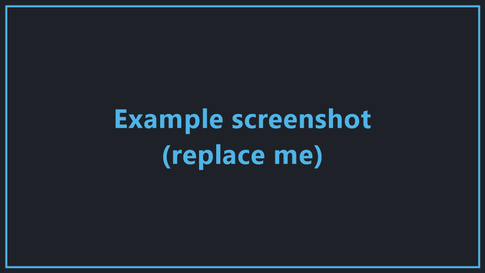
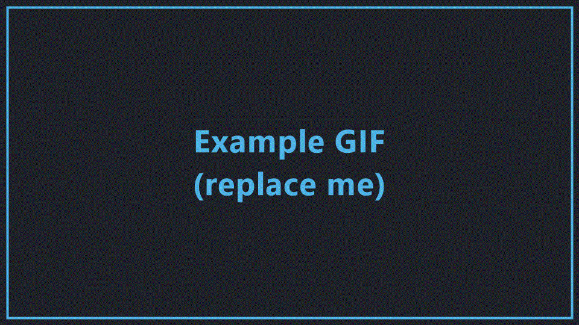

# Example Feature

> This is a **worked example** showing how a feature page looks and how to embed media.
> Use it as a reference, then delete it once you have real feature pages. The matching
> blank template is the [Feature Page Template](./template).

A one- or two-sentence summary of what this feature does and why it's useful.

## Overview

Here's where you describe the feature in more detail. The placeholder image below is a
real screenshot embedded with a **relative** path (`./images/example-screenshot.png`).
Replace it with your own - the file lives in `docs/features/images/`.



## Showing motion with a GIF

GIFs embed exactly like images. This one lives at `./images/example-clip.gif`:



## Showing motion with an MP4

For longer or higher-quality clips, MP4 is smaller and looks better than a GIF. Drop the
file in `docs/public/media/` and embed it with the `<Video>` component:

<Video src="media/example-clip.mp4" />

::: warning Placeholder
The `media/example-clip.mp4` file isn't included yet. Add your own clip at
`docs/public/media/example-clip.mp4` and it will appear in the player above. The Markdown
to embed it is simply:

```md
<Video src="media/example-clip.mp4" />
```
:::

## How to use it

1. Open the relevant menu.
2. Toggle the option.
3. Enjoy the feature.

## Settings

| Setting | Default | Description |
| --- | --- | --- |
| Enable feature | Off | Turns the feature on or off. |
| Some value | 100 | Controls how strong the effect is. |

::: tip
Callouts like this are great for highlighting tips, warnings, and important notes.
:::
